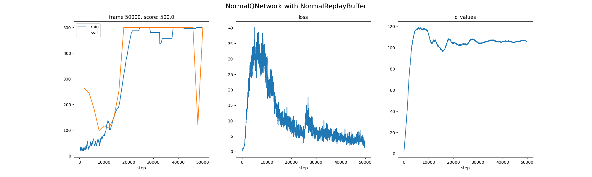
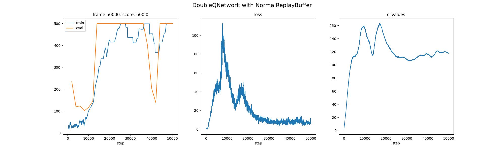
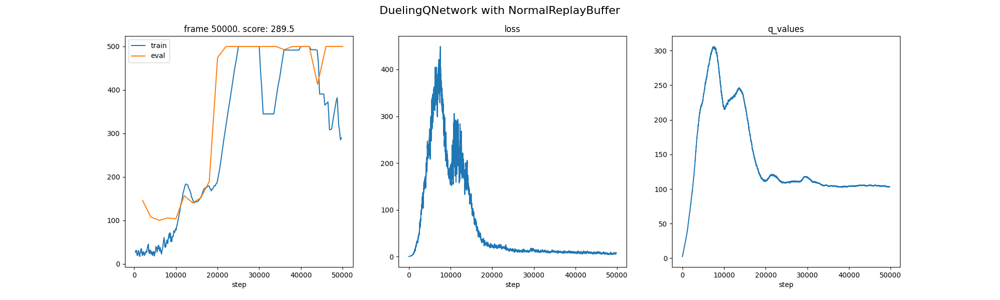
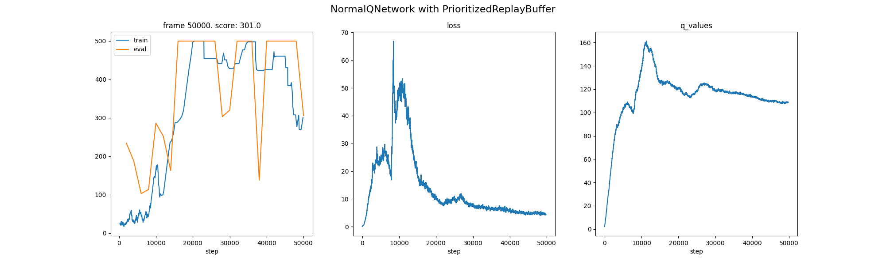
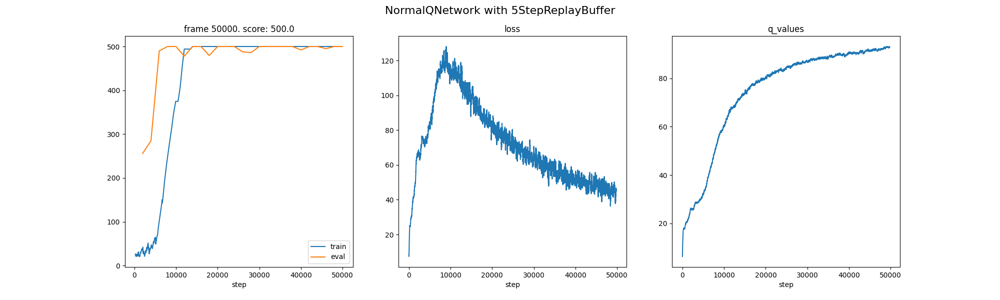
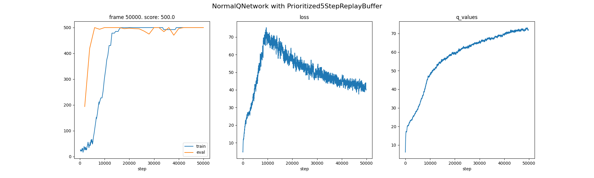

# DRL_HW2: DQN

张瑞泽 2019011189 无98

## 1. Vanilla DQN

对于Carpole这种较为简单的环境可以看出最普通的DQN已经可以解决地比较好，但是return、loss和q_values曲线都有一定程度的抖动，体现出RL的不稳定性。

## 2. Double DQN

double DQN可以解决overestimation的问题，但是使用Q network中argmax的动作作为target Q network的动作可能导致训练会更加不稳定，相比于vanilla DQN，double DQN的曲线会更抖。

## 3. Dueling DQN

dueling DQN采用两个network建模V和A，由于存在对于V和A建模不唯一性的问题，因此强制最优动作的优势函数A的实际输出为 0。观察发现训练过程中同样抖动比较剧烈，相比于vanilla DQN在carpole任务上没有什么优势，可能是由于carpole任务比较简单，动作空间较小导致的。

## 4. Prioritized Experience Replay

加入Prioritized Experience Replay可以提高收敛速度，和vanilla DQN相比，更早地达到return=500，但是在训练后期出现策略坍塌的问题，也可能是不稳定性导致的。

## 5. N-Step Return

这里n取5，可以发现训练过程显著平滑很多，且更快到达收敛过程。理论上来说，N-Step Return是bias和variance的tradeoff，方差减小，因此更加平滑，但是相应地bias增加，对于这个carpole环境影响并不明显。

## 6. Prioritized Experience Replay & N-Step Return

同样这里n取5，可以发现训练过程显著平滑很多。但是和N-Step Return相比，再加上Prioritized Experience Replay对于该问题的改进并不是很明显。