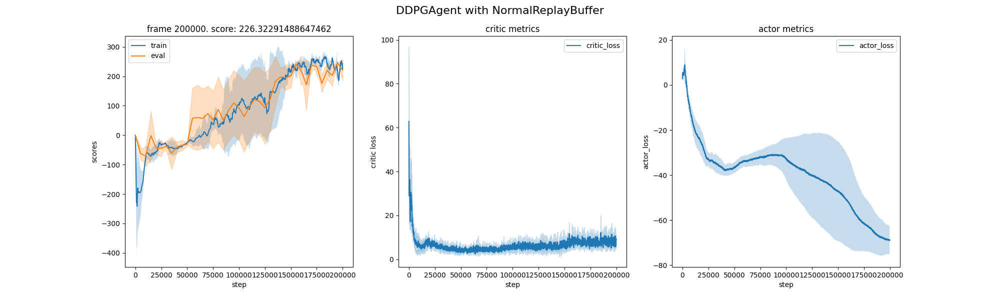
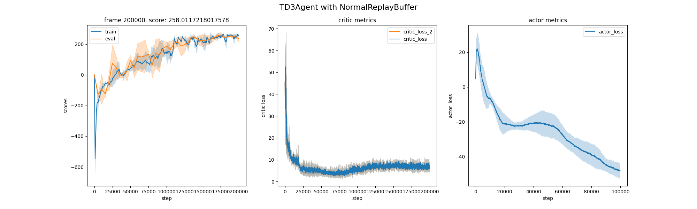
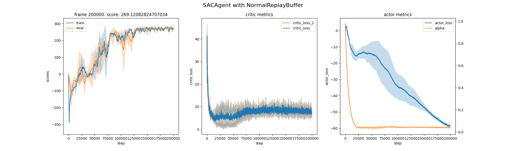

# Homework 3

张瑞泽 2019011189

#### 1 DDPG

DDPG算法结果如下：

在训练过程中，可以发现score的方差比较大，说明DDPG算法并不稳定，这可能是由于overestimation导致的，且policy变化过快。

#### 2 TD3

TD3算法结果如下所示：

相比于DDPG，TD3算法score的方差更小，这是由于增加了Double Q Network，Delayed Policy Updates使更新更加稳定。且最终的score比DDPG更高，这可能是采用Target Policy Smoothing使得policy网络对于action更加光滑，使得探索范围更广，避免固定到某个模式。

#### 3 SAC

SAC算法结果如下所示：

相比于DDPG，SAC算法score的方差更小，但SAC比DDPG抖动会大一点，可能是由于增加了熵，动作范围更大。可学习的alpha下降趋势接近指数形式，说明初始探索更多，随着训练进行，探索减少，利用增多。